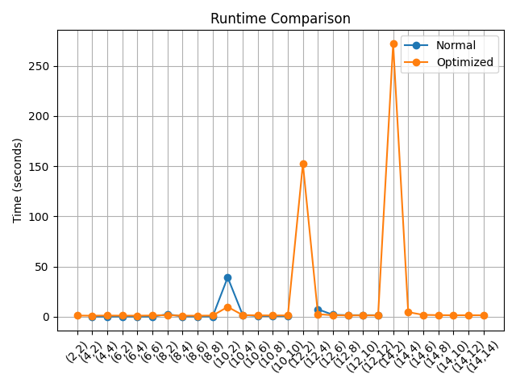
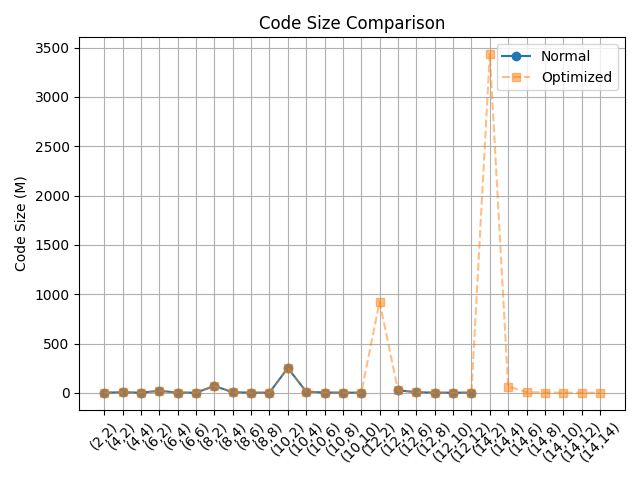

# Constant-Weight Edit Distance Codes

This project explores the construction of constant-weight binary error-correcting codes under the **edit distance** metric. The goal is to compute lower bounds for \( E'\_2(n, d, w) \), where all codewords have fixed length \( n \), constant weight \( w = n/2 \), and pairwise edit distance at least \( d \).

Due to the combinatorial complexity of the problem, exact solutions are infeasible for larger instances. Therefore, this project focuses on efficient computational approaches to construct large valid codes.

---

## 🚀 Key Features

- Binary constant-weight code generation
- Edit distance computation (Levenshtein distance)
- Greedy code construction algorithm
- Randomized multi-run optimization
- Parallel execution using multiprocessing
- Early termination optimization for distance computation
- Automated experiment pipeline with result saving and plotting

---

## 📁 Project Structure

```shell
Edit-Distance-Codes/
│
├── src/ # Core implementation
│ ├── generator.py # Generate binary vectors (constant weight)
│ ├── distance.py # Edit distance + optimized threshold version
│ ├── code_builder.py # Greedy + randomized + parallel construction
│ └── init.py
│
├── experiments/ # Experiment utilities
│ ├── run.py # Run experiments on multiple (n, d)
│ ├── func.py # Helpers (CSV, plots, printing)
│ └── init.py
│
├── report/ # Output results for report
│ ├── results.csv # Experiment results
│ ├── runtime_comparison.png
│ ├── code_size.png
│ └── codewords/ # Generated codewords for appendix
│
├── main.py # Entry point for testing
├── README.md
└── LICENSE
```

---

## 📊 Results

### ⏱️ Runtime Comparison



- The optimized approach significantly reduces runtime for larger values of \( n \)
- Parallel execution and early stopping greatly improve efficiency
- Small cases show similar performance, while large cases benefit the most

---

### 📈 Code Size Comparison



- Both baseline and optimized approaches produce **identical or very similar code sizes**
- This confirms that optimization improves performance **without sacrificing solution quality**
- Code size decreases as the minimum distance \( d \) increases
- Small \( d \) (e.g., \( d=2 \)) allows much larger codes

---

## 🧠 Key Insights

- Edit distance computation is the main computational bottleneck
- Randomization improves solution quality across runs
- Parallelization provides major speedup for large instances
- Small distance constraints lead to exponential growth in valid code size
- Larger values of \( n \) quickly become computationally expensive

---

## ▶️ How to Run

Run experiments:

```bash
python -m experiments.run
```

Or run manually:

```bash
python main.py
```

---

## 📚 References

V. I. Levenshtein, Binary codes capable of correcting deletions, insertions, and reversals, 1966.

---

## 📌 Notes

This project was developed as part of a Coding Theory course and focuses on practical construction methods rather than exact theoretical bounds.